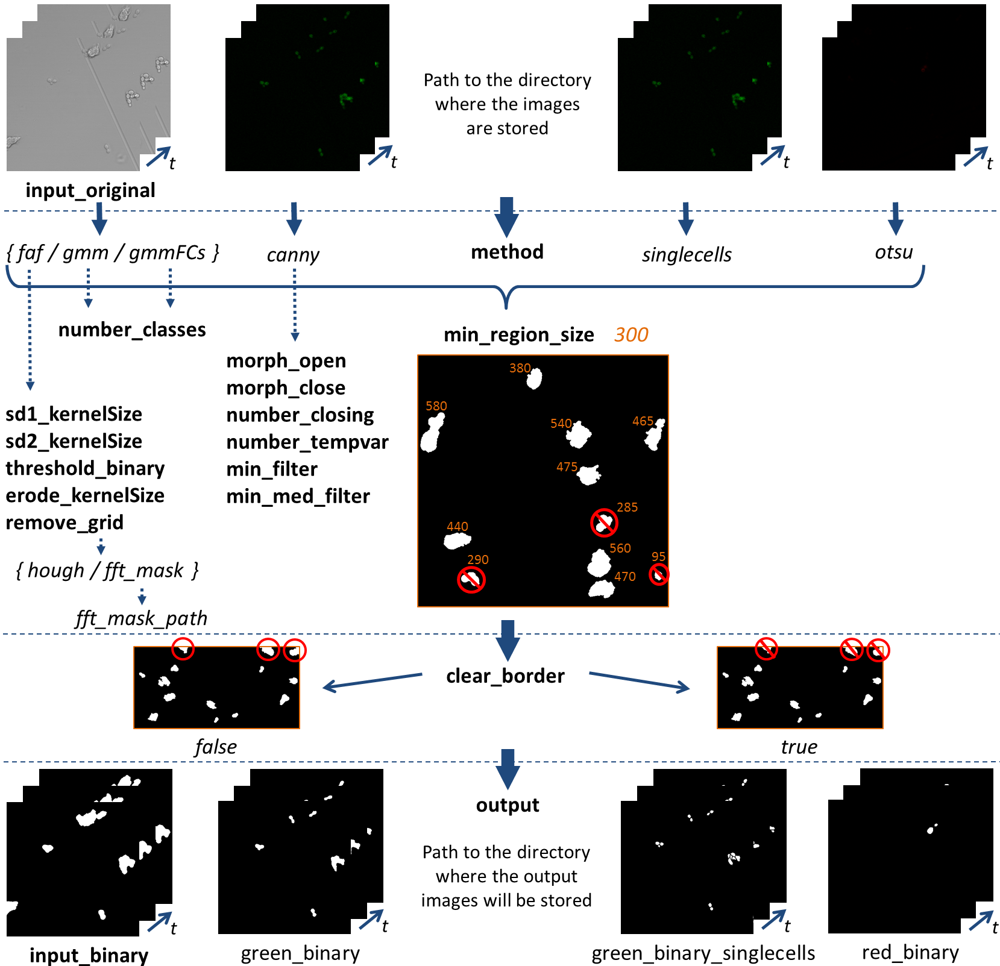
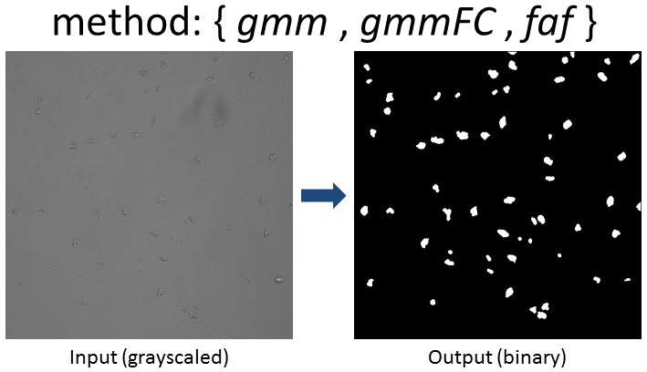

This is the first part of the algorithm for migration and interaction tracking (AMIT). In this part both immune cells and pathogens can be segmented. Multiple segmentation pipelines can be applied on multi-channel live cell videos of migration and confrontation assays (see section **Parameter instructions**).

# How to run AMIT Segmentation:

Run the executable file in the build directory by specifying the path where your configuration file with the required parameters is located with the following command: 

```console
./build/AMITSegmentation/AMITSegmentation --config <path to config file/config.json>

# example
./build/AMITSegmentation/AMITSegmentation --config ./AMITSegmentation/config.json
```

In the following table you can the see the hyper parameters for the algorithm with their corresponding meaning. You can change the values for each parameter in the **AMITSegmentation/config.json** file. To get a better understanding of the individual parameters, take a look at the section **Parameter instructions** and **Further remarks**.

|     Parameter     |      Type      |        Default         | Description                                                  |
| :---------------: | :------------: | :--------------------: | :----------------------------------------------------------- |
|      `input`      | Directory path |     /brightfield/      | Input directory with gray scaled images                      |
|  `input_gmmFCs`   | Directory path |        /green/         | Input directory with green fluorescence channel  (only for `method` *gmmFCs*) |
|     `output`      | Directory path |   /AMITSegmentation/   | Output path where all segmented images will be stored        |
|     `method`      |      Flag      |          ibp           | Method used for segmentation (see **Further remarks**)       |
| `min_region_size` |  Integer >= 1  |          300           | Discard objects smaller than the specified pixel size        |
| `number_closing`  |  Integer >= 1  |           3            | Number of closings applied on ROI to get solid one (only for `method` *gmm*) |
| `number_tempvar`  |  Integer >= 1  |           3            | Number of frames used to calculate the temporal variance (only for `method` *gmm* and *gmmFCs*) |
|   `morph_open`    |  Integer >= 3  |           7            | Kernel size for morphological opening after median blur (only for `method` *canny*) |
|   `morph_close`   |  Integer >= 3  |           11           | Kernel size for morphological closing after edge detection to close the remaining contours (only for `method` *canny*) |
|   `min_filter`    |      Flag      |         false          | Use minimum filtering only (only for `method` *canny*)       |
| `min_med_filter`  |      Flag      |         false          | If the image is very noisy, use minimum filtering in addition to the median filter (only for `method` *canny*) |
|   `remove_grid`   |      Flag      |          none          | Method to remove static grid lines from the images (only for `method` *ibp*, see **Further remarks**) |
|  `fft_mask_path`  |      Flag      | /data/.../fft_mask.png | Path for fft-mask (only for `method` *ibp* and if `remove_grid`=*fft_mask*) |
|  `clear_border`   |      Flag      |         false          | Remove objects that are connected to the edge of the image   |
|      `debug`      |      Flag      |         false          | Produces an additional output                                |
|    `n_threads`    |  Integer >= 1  |           1            | Number of threads used                                       |

------

## Parameter instructions:



------

## Further remarks:

- **`method`** for the segmentation, see the valid types in the following and the config.json file:
  
- `gmm`: Normal PMNs (for brightfield and gray scaled images)
  
- `ibp`: Normal PMNs (for brightfield and gray scaled images, method includes flat cells)
  
- `gmmFCs`: Normal PMNs, requires the additional path `input_FCs`  to fungal cells on green fluorescence channel  (for brightfield and gray scaled images, especially for images with flat cells) 
  
  
  
- `canny`: Fungal cells on green fluorescence channel
  
  
  
- `singlecells`: Fungal cells on green fluorescence channel (including cluster splitting for convex shape) 
  
  
  
- `otsu`: Cells on red fluorescence channel with dead PI-stained cells
  
    
  
- **`remove_grid`** function to remove static grid lines from the images, if necessary (only for method *ibp*)
  
  - `hough` : Usage of hough transformation, which automatically detect grid lines
  
  - `fft_mask`: remove grid lines in Fourier space by point-wise multiplication of transformed image with a manually created binary mask (preferably created with image processing program Fiji), specify path to binary mask with parameter `fft_mask_path`
  
    

