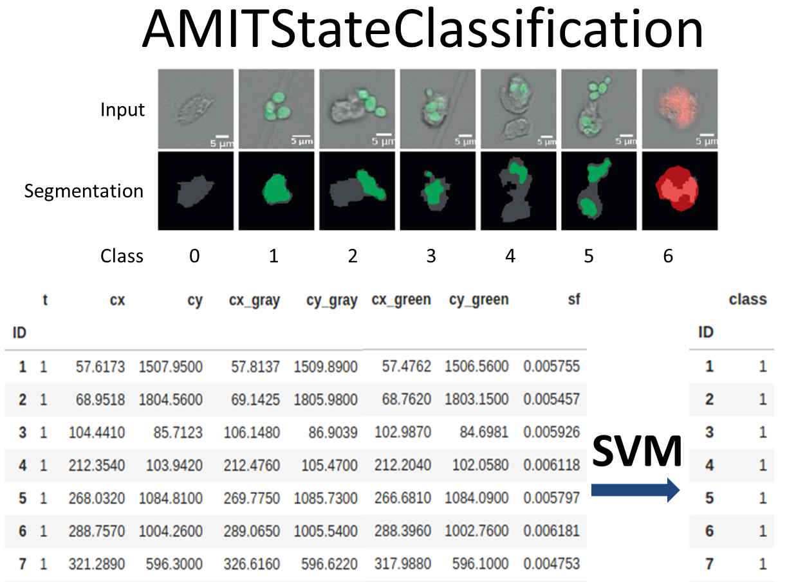

This is the second part of AMIT. In this part the previously segmented immune cells and pathogens are classified into different states, which can occur in phagocythosis.

# How to run AMIT StateClassification:

Run the executable file in the build directory by specifying the path where your configuration file with the required parameters is located with the following command: 

```
./build/AMITStateClassification/AMITStateClassification --config <path to config file/config.json>

# example
./build/AMITStateClassification/AMITStateClassification --config ./AMITStateClassification/config.json
```

In the following table you can the see the hyper parameters for the algorithm with their corresponding meaning. You can change the values for each parameter in the **AMITStateClassification/config.json** file.

|   Parameter    |      Type      |             Default             | Description                                           |
| :------------: | :------------: | :-----------------------------: | ----------------------------------------------------- |
|  `input_gray`  | Directory path |          /brightfield/          | Input directory with gray scaled images               |
| `input_binary` | Directory path |    /AMITSegmentation/binary/    | Binary segmented images of `input_gray`               |
| `input_fungal` | Directory path | /AMITSegmentation/green_binary/ | Binary segmented images of green fluorescence channel |
|  `input_dead`  | Directory path |  /AMITSegmentation/red_binary/  | Binary segmented images of red fluorescence channel   |
|    `output`    | Directory path |    /AMITStateClassification/    | Output path where all results will be stored          |
|    `debug`     |      Flag      |              false              | If used additional outputs will be produced           |
|  `n_threads`   |  Integer >= 1  |                1                | Number of threads used                                |

------


