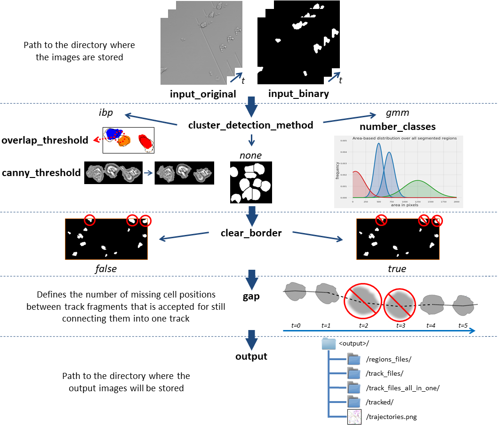

This is the third part of AMIT. In this part the previously segmented cells will be tracked. The second part of the StateClassification is not used for migration tracking. If both immune cells and pathogens with whose respective interactions are supposed to be tracked, the output of the StateClassification is required (see section **Parameter Instructions**).

# How to run AMIT Tracking:

Run the executable file in the build directory by specifying the path where your configuration file with the required parameters is located with the following command: 

```console
./build/AMITTracking/AMITTracking --config <path to config file/config.json>

# example
./build/AMITTracking/AMITTracking --config ./AMITTracking/config.json
```

In the following table you can the see the hyper parameters for the algorithm with their corresponding meaning. You can change the values for each parameter in the **AMITTracking/config.json** file. To get a better understanding of the individual parameters, take a look at the section **Parameter instructions** and **Further remarks**.

|         Parameter          |       Type        |          Default          | Description                                                  |
| :------------------------: | :---------------: | :-----------------------: | :----------------------------------------------------------- |
|      `input_original`      |  Directory path   |          /brightfield/           | Input directory with gray scaled images                      |
|       `input_binary`       |  Directory path   | /AMITSegmentation/binary/ | Input directory with segmented binary images                 |
|          `output`          |  Directory path   |  /AMITTracking/  | Output path where all results will be stored                 |
|       `clear_border`       |       Flag        |           false           | Remove objects that are connected to the edge of the image   |
| `cluster_detection_method` |       Flag        |            faf            | Possible methods to detect/discard clusters are: *gmm*, *faf* or *none* . Select *none* if all clusters within the segmentation have been split or if there are certainly none. |
|      `number_classes`      |  Integer = {2,3}  |             2             | Number of estimate the Gaussian Mixture distributions of cell areas with 2 or 3 classes (only for `method` *gmm*) |
|    `overlap_threshold`     |   Float = [0,1]   |            0.1            | Threshold in percent for overlapping objects between 2 frames (only for `method` *faf*) |
|     `canny_threshold`      | Integer = [0,255] |            100            | Canny threshold for single cell segmentation within a cluster (only for `method` *faf*) |
|           `gap`            |   Integer >= 0   |             2             | Defines the number of missing cell positions between track fragments that is accepted for still connecting them into on track |
|          `delay`           |   Integer >= 0    |             0             | Difference between indizes of binary and original images     |
|         `fontsize`         |   Integer >= 1    |             1             | Outline font size in images                                  |
|          `debug`           |       Flag        |           false           | Produces an additional output                                |
|        `n_threads`         |   Integer >= 1    |             1             | Number of threads used                                       |

------

## Parameter instructions:



------

## Further remarks:

- **`number_classes`** for estimate the Gaussian Mixture distributions of cell areas with 2 or 3 classes:
  - `number_classes` = 3: 
    -  (0) single cells
    -  (1) two or more cells = cell cluster 
    -  (2) other (e.g. noise)         
  - `number_classes` = 2 (assuming noisy objects does not exist):
    - (0) single cells
    - (1) two or more cells = cell cluster

