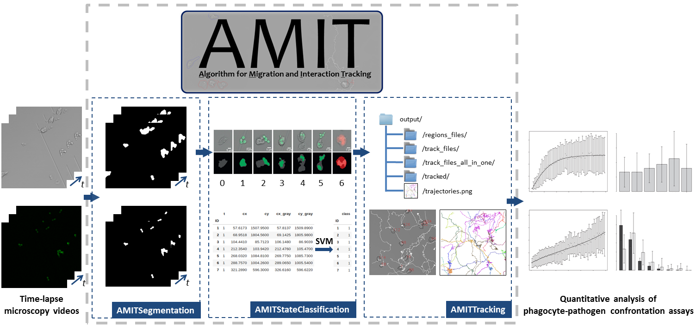

<p align="center">
  
</p>
------

#### This framework allows the segmentation, classification and tracking of immune cells such as PMNs or macrophages and fungal cells in migration and confrontation assays.

------

## Dependencies

**AMIT** depends on following libraries:

| Library             | Version          | Author                                                | URL                                 |
| ------------------- | ---------------- | ----------------------------------------------------- | ----------------------------------- |
| JSON for modern C++ | 2.1.1- or higher | Niels Lohmann                                         | https://github.com/nlohmann/json/   |
| Boost               | 1.65 or higher   | Boost Community                                       | https://www.boost.org/              |
| OpenMP              | 5.0.1            | OpenMP ARB                                            | https://www.openmp.org/             |
| OpenCV              | 3.2 or higher    | OpenCV                                                | https://opencv.org/releases/        |
| LEMON Graph library | 0.7 or higher    | Egerváry Research Group on Combinatorial Optimization | https://lemon.cs.elte.hu/trac/lemon |

You need a compiler capable of C++ version 2017 or higher to compile **AMIT**.

## Installation 

##### Install it by building it yourself 

If all dependencies are installed on the system, just run:

```shell
mkdir build
cd build
cmake -DCMAKE_BUILD_TYPE=Release ..
make
```

## Building missing dependencies

### OpenCV

For servers:

```shell
wget https://github.com/opencv/opencv/archive/3.2.0.zip -O opencv-3.2.0.zip
unzip opencv-3.2.0.zip
cd opencv-3.2.0
mkdir build
cd build
cmake -DCMAKE_INSTALL_PREFIX=$HOME/opencv-3.2.0 -DCMAKE_BUILD_TYPE=Release -DWITH_IPP=OFF -DBUILD_TIFF=ON -DWITH_GTK=OFF ..
make
make install
```

`-DWITH_IPP=OFF` and `-DBUILD_TIFF=ON` can be left out, but are usually required for our servers.
`-DWITH_GTK=OFF` is necessary.

### LEMON

```shell
wget http://lemon.cs.elte.hu/pub/sources/lemon-1.3.1.tar.gz
tar -xvf lemon-1.3.1.tar.gz
cd lemon-1.3.1
mkdir build
cd build
cmake -DCMAKE_INSTALL_PREFIX="$HOME/lemon-1.3.1" -DCMAKE_BUILD_TYPE=Release ..
make
make install
```

### nlohmann_json

```shell
sudo apt-get update
sudo apt-get install nlohmann-json-dev
```

## Building with custom dependencies

Add the install directories to the CMake prefix path:

```shell
mkdir build
cd build
cmake -DCMAKE_BUILD_TYPE=Release -DCMAKE_PREFIX_PATH="$HOME/opencv-3.2.13.6;$HOME/lemon-1.3.1" ..
make
```

## Usage

Take a closer look at the corresponding *README* - files in the respective subfolders for each application (`AMITSegmentation`, `AMITStateClassification`, `AMITTracking`).

------

## Citation

Please cite  **AMIT** if you are using this work in your publication. Here is an example BibTeX entry:

> ```json
> @article{Belyaev2021,
>   doi = {10.1002/cyto.a.24466},
>   url = {https://doi.org/10.1002/cyto.a.24466},
>   year = {2021},
>   month = jun,
>   publisher = {Wiley},
>   author = {Ivan Belyaev and Jan-Philipp Praetorius and Anna Medyukhina and Marc Thilo Figge},
>   title = {Enhanced segmentation of label-free cells for automated migration and interaction tracking},
>   journal = {Cytometry Part A}
> }
> ```


